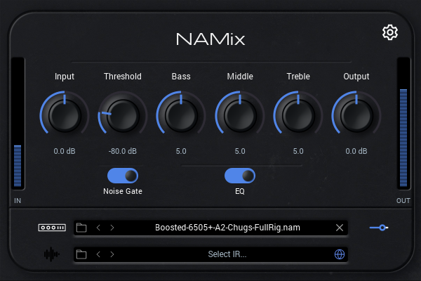
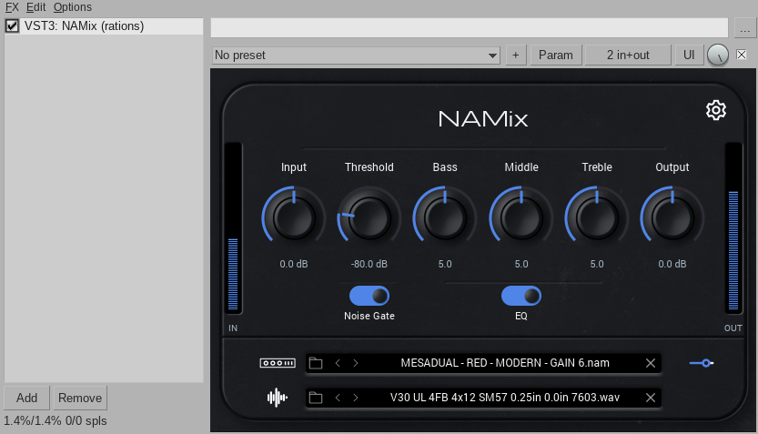

# NAMix

NAMix is a neural amp modeller plugin for Linux. It is based on
[NeuralAmpModelerPlugin](https://github.com/sdatkinson/NeuralAmpModelerPlugin)
by Steven Atkinson and all contributors to the Neural Amp Modeler project.
All original copyright is retained by Steven Atkinson.

iPlug2, the framework used by the original plugin, has no working Linux
backend. NAMix is therefore a **raw VST3** plugin: it is written directly
against the [VST 3 SDK](https://github.com/steinbergmedia/vst3sdk), embeds its
editor into the host window through `IPlugView`, and paints that editor itself
with Cairo and FreeType. There is no plugin framework and no GUI toolkit in the
build, which lets NAMix keep the original project's **MIT licence**.

It also ships as an **LV2** bundle. The LV2 is not a port: it is the same
processor and the same panel behind an adapter that lets an LV2 host drive
them, so both formats share one DSP path, one editor and one state format.
See [LICENSE](https://github.com/rations/NAMix/blob/master/LICENSE) and
[NOTICE](https://github.com/rations/NAMix/blob/master/NOTICE) for full details.




NAMix ships as three separate binaries:

| Binary | Use |
|---|---|
| `NAMix.vst3` | VST3 plugin — load inside a DAW (REAPER, Ardour, Bitwig, Carla, …) |
| `NAMix.lv2` | LV2 plugin — the same plugin, for hosts that prefer LV2 (Ardour, Qtractor, Zrythm, Carla, …) |
| `namix-standalone` | Standalone application — runs without a DAW, connects directly to JACK |

**The VST3 and the LV2 are the same plugin twice** and are interchangeable:
same DSP, same panel, same state format, so a project saved with one opens
with the other. Install whichever your host prefers, or both.

---

## System requirements

NAMix requires **glibc 2.35 or later**. This is present in:

| Distro | Version |
|---|---|
| Ubuntu | 22.04 LTS or newer |
| Debian | 12 (Bookworm) or newer |
| Devuan | 5 (Daedalus) or newer |
| Fedora | 36 or newer |
| Linux Mint | 21 or newer |
| Pop!_OS | 22.04 or newer |
| MX Linux | 23 or newer |
| Arch Linux | rolling |
| Manjaro | rolling |
| openSUSE Tumbleweed | rolling |
| Void | rolling |

Ubuntu 20.04, Debian 11 (Bullseye), RHEL/CentOS 9, and openSUSE Leap 15.x
ship glibc 2.31–2.34 and will not load these binaries. Users on those systems
should build from source (see below).

Both plugins need Cairo, FreeType, fontconfig and libX11 at runtime — all are
present on any desktop Linux install. Neither links JACK.

The standalone additionally needs the JACK client library (`libjack.so.0`) and
a running JACK server — `sudo apt install jackd2` on Debian/Devuan/Ubuntu, or
`pipewire-jack` on a PipeWire desktop. Both ship the library, so if you already
run JACK you already have it. No `-dev` packages are needed to *run* NAMix;
those are only for building from source.

---

## Installing the pre-built release

Download the `NAMix-<version>-linux-x86_64.tar.gz` asset from the
[latest release](https://github.com/rations/NAMix/releases/latest).

Extract it and enter the directory it creates — the version is part of both
names, so let the shell fill it in:

```bash
tar -xzf NAMix-*-linux-x86_64.tar.gz
cd NAMix-*/
```

(If you keep several versions side by side, name the one you want instead of
using the glob.) The directory holds all three binaries; install whichever you
need.

**VST3 plugin** — copy into your user VST3 folder:

```bash
mkdir -p ~/.vst3
cp -r NAMix.vst3 ~/.vst3/
```

**LV2 plugin** — copy into your user LV2 folder:

```bash
mkdir -p ~/.lv2
cp -r NAMix.lv2 ~/.lv2/
```

Either way the plugin will appear as **NAMix** in any host that scans that
folder. Both bundles carry their own icons and fonts, so nothing else needs
installing.

If a host keeps showing an older version of the LV2, look for a copy shadowing
this one — a bundle under `/usr/lib/lv2` or `/usr/local/lib/lv2` takes
precedence over `~/.lv2` in most hosts:

```bash
ls -d /usr/lib/lv2/NAMix.lv2 /usr/local/lib/lv2/NAMix.lv2 2>/dev/null
```

**Standalone application** — run it from that same directory, with a JACK
server already running:

```bash
./namix-standalone
```

To uninstall, remove the installed plugins and the directory you extracted:

```bash
rm -rf ~/.vst3/NAMix.vst3 ~/.lv2/NAMix.lv2
```

---

## Building from source

```bash
git clone https://github.com/rations/NAMix.git
cd NAMix
git submodule update --init --recursive

cmake -B build -G Ninja -DCMAKE_BUILD_TYPE=Release
cmake --build build --parallel $(nproc)
```

Required system packages (Debian/Ubuntu):

```
build-essential cmake ninja-build pkg-config libcairo2-dev libfreetype-dev
libfontconfig-dev libx11-dev libjack-jackd2-dev lv2-dev liblilv-dev
```

`lv2-dev` is what builds the LV2 bundle; without it the build skips it and says
so. `liblilv-dev` is needed only by `namix_lv2check`, the bundle's own test —
nothing that ships links lilv.

The VST 3 SDK is included as a submodule. To build against a checkout you
already have, pass `-DVST3_SDK_DIR=/path/to/vst3sdk` instead.

After building, install whichever format you want:

```bash
mkdir -p ~/.vst3 && cp -r build/VST3/Release/NAMix.vst3 ~/.vst3/
mkdir -p ~/.lv2  && cp -r build/lv2/NAMix.lv2          ~/.lv2/
```

Verify the VST3 with Steinberg's validator, which is built alongside it:

```bash
./build/bin/Release/validator build/VST3/Release/NAMix.vst3
```

Verify the LV2 bundle with its own gate. It checks what a host actually sees —
the export surface, the port table read back through lilv, the
`ui:portNotification` declarations the meters depend on — then installs to
`~/.lv2`, loads the binary, runs it and round-trips its state:

```bash
bash scripts/lv2-gate.sh --model ~/path/to/some-capture.nam
```

To render the editor panel to a PNG without a host or an X server — useful for
checking the layout after changing `src/namgeometry.h`:

```bash
./build/panelrender /tmp/panel.png resources
```

To build and package a release archive:

```bash
bash scripts/makedist-linux.sh
```

---

## Usage

1. Load a `.nam` model file by clicking the **model** row; an in-plugin browser
   opens. The `<` and `>` arrows step through the other models in the same
   folder, and the **✕** clears the current one.
2. Optionally load an impulse response (`.wav`) on the **IR** row the same way.
3. Adjust **Input**, **Output**, and tone-stack knobs (**Bass**, **Middle**,
   **Treble**) by dragging vertically, or with the mouse wheel.
4. The **EQ** toggle enables or disables the tone stack.
5. The **Noise Gate** toggle enables the noise gate; the **Threshold** knob
   sets the gate level.
6. The **⚙** (gear) button opens the settings panel, where you can configure
   the input calibration level and output mode (Raw / Normalized / Calibrated).
   Options the loaded capture does not support are greyed out.
7. If the loaded model supports slimming, a small icon appears to the right of
   the model row. Click it to open the Slim overlay and reduce the model size.

Hosts without a GUI can still load models: the edit controller implements a
small `INamFileLoader` interface, discoverable through `queryInterface`, that
takes model and IR paths directly.

---

## Credits

- [Steven Atkinson](https://github.com/sdatkinson) — Neural Amp Modeler,
  NeuralAmpModelerCore, AudioDSPTools, original plugin design and assets
- All contributors to [NeuralAmpModelerPlugin](https://github.com/sdatkinson/NeuralAmpModelerPlugin)
- [Steinberg](https://github.com/steinbergmedia/vst3sdk) — VST 3 SDK
- [Mikko Mononen](https://github.com/memononen/nanosvg) — NanoSVG, which
  rasterises the plugin's icons

---

## Licence

NAMix is released under the
[MIT Licence](https://github.com/rations/NAMix/blob/master/LICENSE), the same
licence as the original Neural Amp Modeler plugin.

The Neural Amp Modeler DSP core, original plugin code, and graphical assets are
copyright Steven Atkinson and used under the MIT Licence. The VST 3 SDK is MIT
(Steinberg). NanoSVG is zlib-licensed. Eigen is MPL 2.0. The fonts Michroma
(OFL 1.1) and Roboto (Apache 2.0) are bundled under their respective open
licences. See [NOTICE](https://github.com/rations/NAMix/blob/master/NOTICE) for
full attribution and licence texts.

VST is a trademark of Steinberg Media Technologies GmbH, registered in Europe
and other countries.
